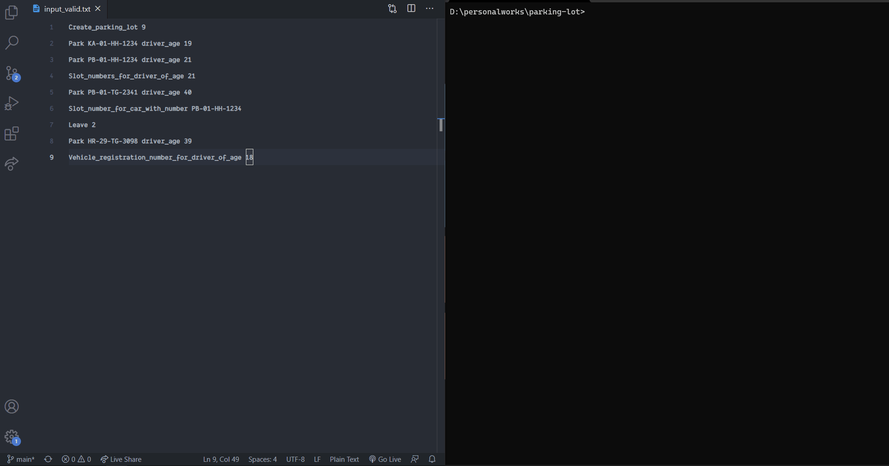

# SQUAD PARKING

A general solution for parking lot problem.

### Init Setup

Clone this repo and you are set to go.

---

### INSTALLATION 

There are no additional dependencies for this to run. This is plain Python (3.8). You do not need to create a virtual environment just to run this. **YAY!**. This is system agnostic and will work on any system as long as Python is installed.

---

### Some additional tools used

- Formatter: autopep8
- Linter: pylint
- IDE: VsCode
- Python Server: Microsoft
- Python Verison: 3.8

---

### How do I run this?

Make sure you are at the root directory (inside squad-parking) to run further commands.

You can run the program just by:

```python
python main.py
```

this will ask you to enter the file (path of where your file is located, including the file name with txt extension). Enter the file path and press enter to proceed with execution.

---

### What about the test cases?

You can run the existing test cases by:

```python
python -m unittest discover tests
```

> All unit tests, follow the common naming convention.

The above command will print out everything for you. If that is not what you want then please try below command:

```python
python -m unittest discover tests -b
```

`-b` flag will supress the print statements.

Also, if you wish to run individual test suite then you can run:

```python
python -m unittest tests/<test_filename>.py -b
```

> Note: There are some sample input files in `input` directory. These are used for test cases.

---

### Gotchas/Things to note

- All the content is processed in small cases. i.e. For example: number plate: `AH-01-KJ-0001` will be processed and shown as `ah-01-kj-0001`

---

### Demo? Sure.

Take a look at the video below to get an Idea of how the program works.


